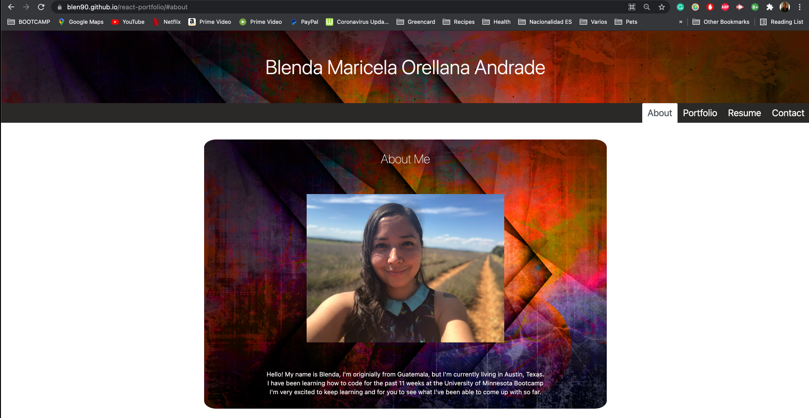
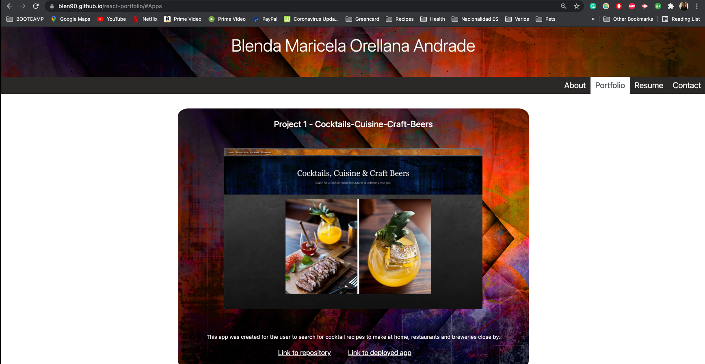
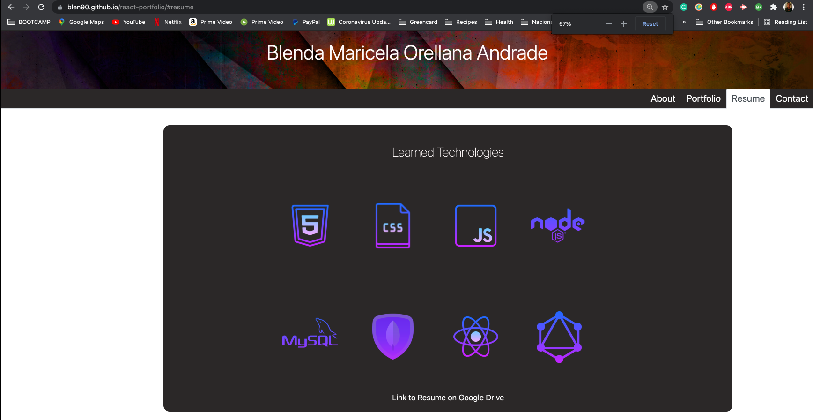
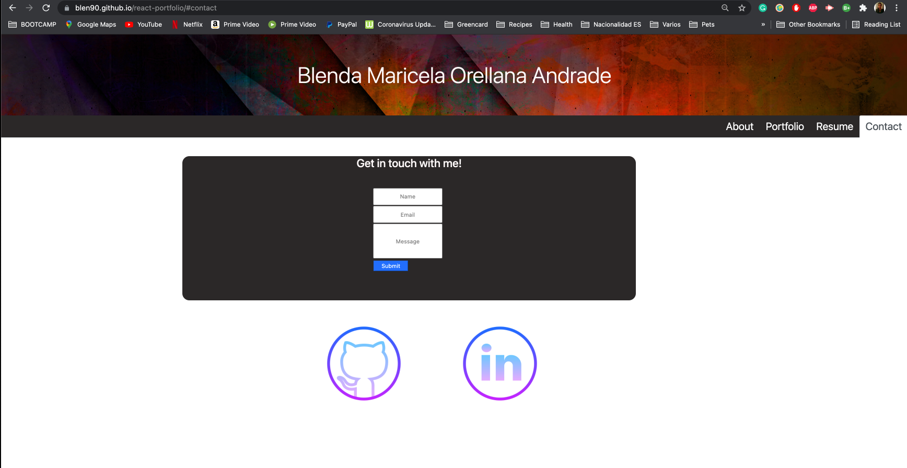

# react-portfolio

Welcome to my Portfolio. I used React, CSS, Bootstrap and JSX to create it. 

You will find the following pages: 
* About me page
* Portfolio with the projects and homework assignments I've worked on
* Resume page with technologies I have learned linking resources for each and a link to my resume that can be downloaded
* Contact form that validates whether there was user input and what is required

---

## Deployed link to the app on Heroku

https://blen90.github.io/react-portfolio/#about

---

## My task

Your task is to create a portfolio using your new React skills, which will help set you apart from other developers whose portfolios don’t use the latest technologies.

---
## Screenshot of Workout Tracker

---
### Created by Blenda Orellana