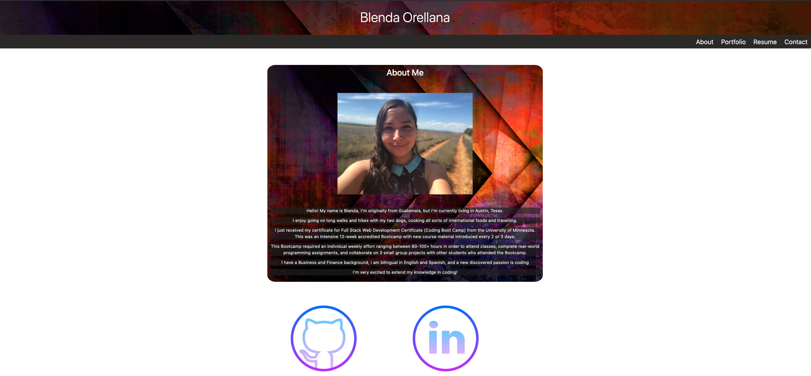
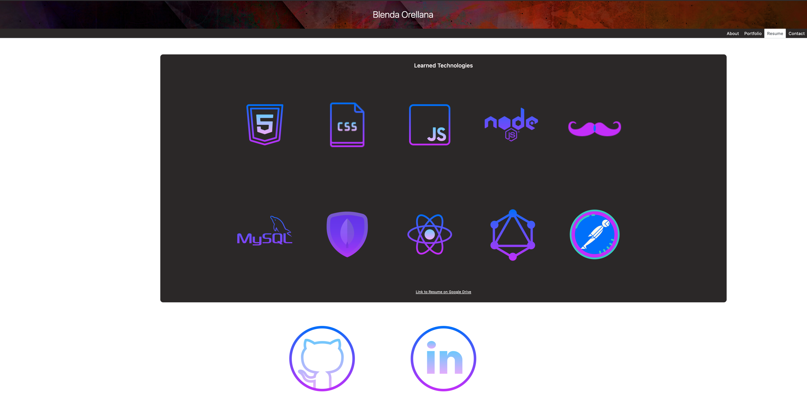
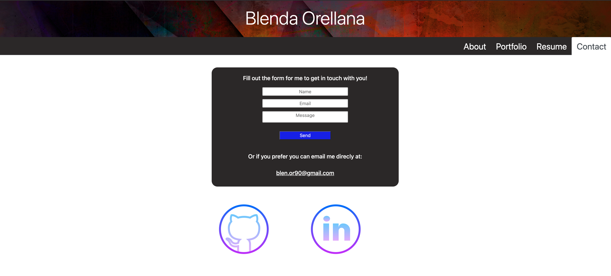

# Portfolio

# Description

Welcome to my personal portfolio! 

You will find the following pages:
* About me page
* Portfolio that has some of the projects and homework assignments I worked on during the Bootcamp.
* Resume page with technologies I have learned linking resources for each and a link to my resume on Google Drive that can be downloaded
* Contact form
* Footer that has direct links to my Github profile and LinkedIn profile

## Deployed App link 

https://blen90.github.io/react-portfolio/#about

## Screenshots of the app

# Table of Contents

* [Installation](#installation)
    
* [Usage](#usage)

* [Technology](#technology)

* [License](#license)

* [Contributors](#contributors)

* [Questions](#questions)

# Installation

Visit the deployed app in the following link: https://blen90.github.io/react-portfolio/#about

# Usage

The app is to get to know me a bit better and show case the apps I've been able to work on during the past 14 weeks since my coding journey began. 

# Technology

* React
* Bootstrap
* Npm packages
* CSS

# License 

This project is governed by: MIT License

# Contributors

Blenda Orellana

# Questions

If you have any questions about the repo or the app please feel free to contact me
 * Email: blen.or90@gmail.com
 * Github: https://github.com/blen90
